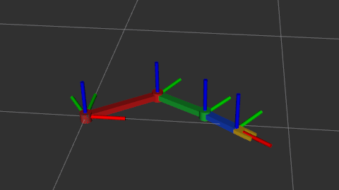
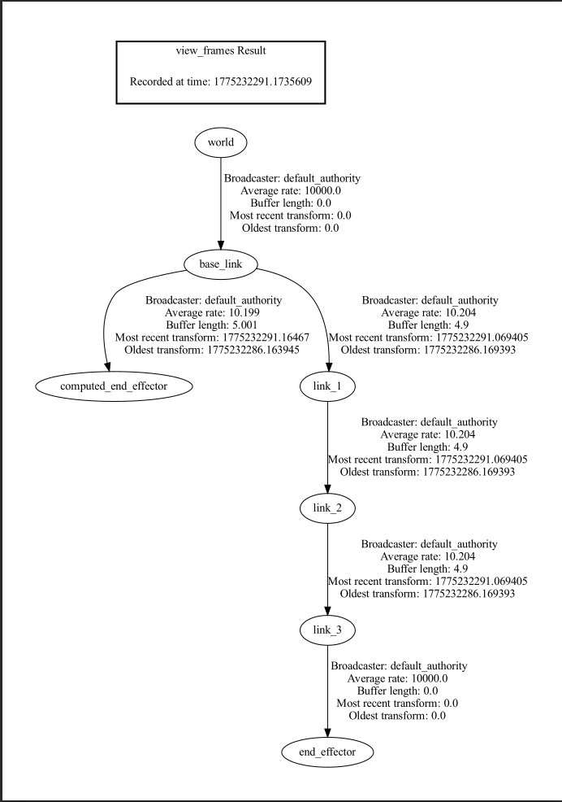
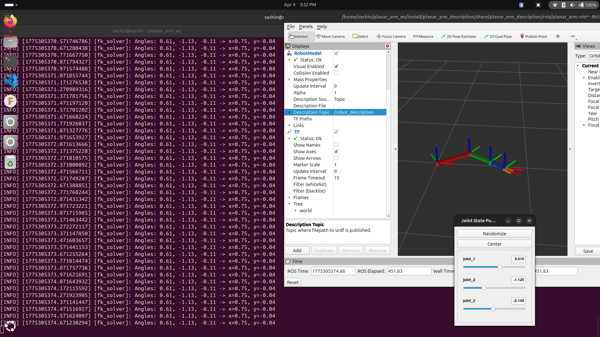
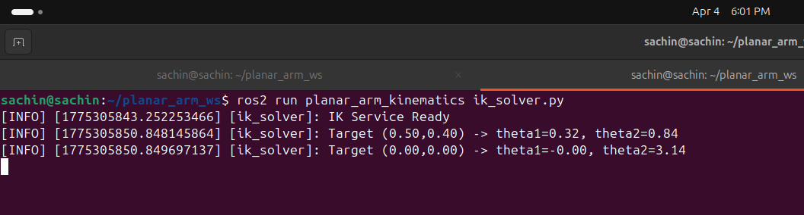
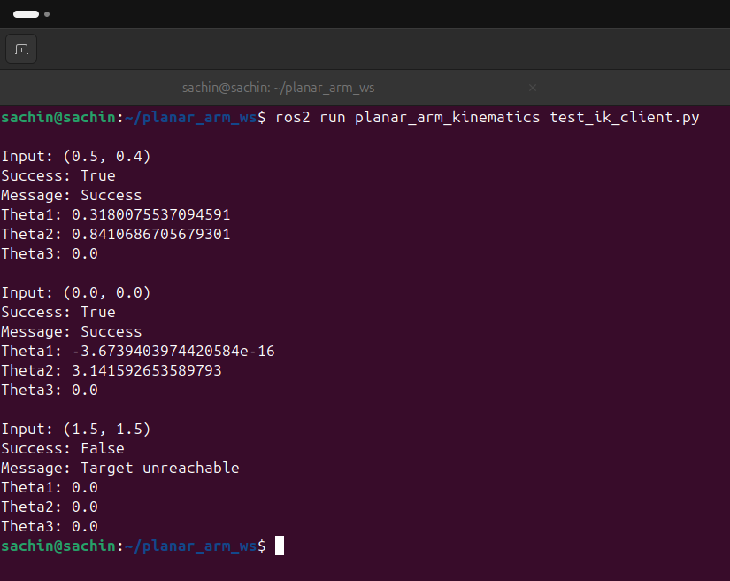
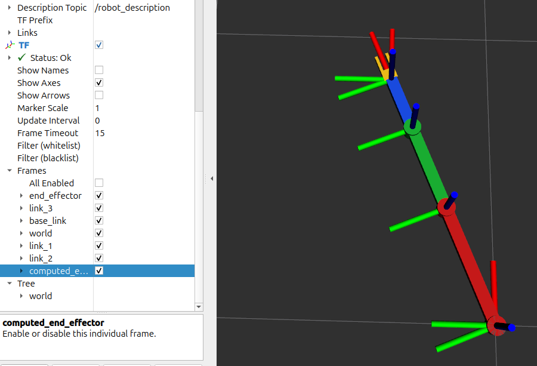

# 🦾 3-DOF Planar Robotic Arm — ROS 2 (Jazzy)

## 📌 Overview

This project implements a **3-DOF planar robotic arm** using **ROS 2 Jazzy**.
It includes:

* URDF/Xacro modeling of the robot
* Forward Kinematics (FK) computation node
* Inverse Kinematics (IK) service
* Visualization in RViz2 with TF tree

The arm operates in the **XY plane (2D motion)**.

---

## ⚙️ Robot Specifications

| Parameter          | Value            |
| ------------------ | ---------------- |
| Link 1 Length (L1) | 0.4 m            |
| Link 2 Length (L2) | 0.3 m            |
| Link 3 Length (L3) | 0.2 m            |
| Joint Type         | Revolute         |
| Motion             | Planar (XY)      |
| Joint Limits       | −π to +π radians |

---

## 🧱 Package Structure

```
planar_arm_ws/
 └── src/
     ├── planar_arm_description/
     │   ├── launch/
     │   ├── urdf/
     │   ├── rviz/
     │   ├── CMakeLists.txt
     │   └── package.xml
     │
     └── planar_arm_kinematics/
         ├── planar_arm_kinematics/
         │   ├── fk_solver.py
         │   ├── ik_solver.py
         │   └── test_ik_client.py
         ├── srv/
         │   └── ComputeIK.srv
         ├── CMakeLists.txt
         └── package.xml
```

---

## 🚀 Build Instructions

```bash
cd ~/planar_arm_ws
colcon build
source install/setup.bash
```

---

## ▶️ Run Instructions

### 1. Launch Robot (URDF + RViz)

```bash
ros2 launch planar_arm_description display.launch.py
```

---

### 2. Run Forward Kinematics (FK)

```bash
ros2 run planar_arm_kinematics fk_solver.py
```

Move sliders in GUI → observe position output.

---

### 3. Run Inverse Kinematics (IK)

Start service:

```bash
ros2 run planar_arm_kinematics ik_solver.py
```

Run client:

```bash
ros2 run planar_arm_kinematics test_ik_client.py
```

---

### 4. Manual IK Test

```bash
ros2 service call /compute_ik planar_arm_kinematics/srv/ComputeIK "{target_x: 0.5, target_y: 0.4}"
```

---

## 📊 Forward Kinematics

The end-effector position is computed as:

```
x = L1*cos(θ1) + L2*cos(θ1+θ2) + L3*cos(θ1+θ2+θ3)
y = L1*sin(θ1) + L2*sin(θ1+θ2) + L3*sin(θ1+θ2+θ3)
```

---

## 🔄 Inverse Kinematics

Using geometric approach (with θ3 = 0):

```
cos(θ2) = (x² + y² − L1² − L2²) / (2L1L2)
θ1 = atan2(y, x) − atan2(L2*sin(θ2), L1 + L2*cos(θ2))
```

---

## 📸 Results

Screenshots included:

  
  * RViz robot model

  
  * TF tree
    
     
  * FK output set to random and zero
    

  
  IK Solver
  
  
  
  Test IK Client
  * IK results

  
  * Computed End Effector TF frame

---

# 🧠 Conceptual Questions

---

## 1. Forward vs Inverse Kinematics

Forward Kinematics computes the end-effector position from known joint angles.
Inverse Kinematics computes joint angles required to reach a desired position.
FK is used for state estimation, while IK is used for motion planning and control.

---

## 2. Kinematic Singularity

A singularity occurs when the robot loses degrees of freedom.
In this project, when the arm is fully stretched or folded, it becomes singular.
The IK solver handled this by clamping values to avoid invalid math operations.

---

## 3. Role of TF in ROS 2

TF maintains transformations between coordinate frames.
The `computed_end_effector` frame shows the FK result.
A correct TF tree ensures accurate visualization and coordination between components.

---

## 4. Mobile Robot vs Arm Planning

Mobile robots plan motion in Cartesian space (x, y).
Robotic arms plan in joint space (angles).
Arm planning involves kinematics and constraints, making it more complex.

---

## 5. Extending to 6-DOF

Challenges include:

* Multiple IK solutions
* Increased computational complexity
* Handling orientation (roll, pitch, yaw)
* Singularities and redundancy

---

# ✅ Conclusion

This project demonstrates:

* URDF modeling
* ROS2 node development
* Kinematics implementation
* TF integration

It provides a strong foundation in robotic manipulation using ROS 2.

---
